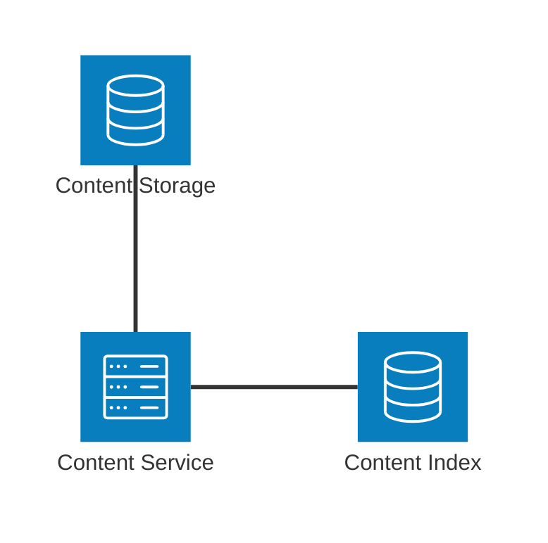

The Content Service is the heart and center of griot. It is responsible for ingesting, storing,
and indexing content from users.

## Architecture Diagram

Content will be indexed and stored by it's [Content ID](#content-id).
The [Content ID](#content-id) will be generated when the content is first uploaded.

## Content ID

Content IDs will be generated by the following steps:
1. [base64](https://en.wikipedia.org/wiki/Base64) encode the user provided given content checksum to produce, `base64_hash`
2. Create a string with the given format: `{hash_func}/{base64_hash}`
3. Hash the string using [SHA-256](https://en.wikipedia.org/wiki/SHA-2)
4. Finally, the Content ID will be given by the [base64](https://en.wikipedia.org/wiki/Base64) encoding of the string hash

This format for the Content ID partially follows the [Content Addressable Storage](https://en.wikipedia.org/wiki/Content-addressable_storage)
pattern. One issue we face is when a different hash function is used to
store the same piece of content. This issue is partially solved by leveraging the
[Content Index]({}) during the [Upload Content v1]({}) process.