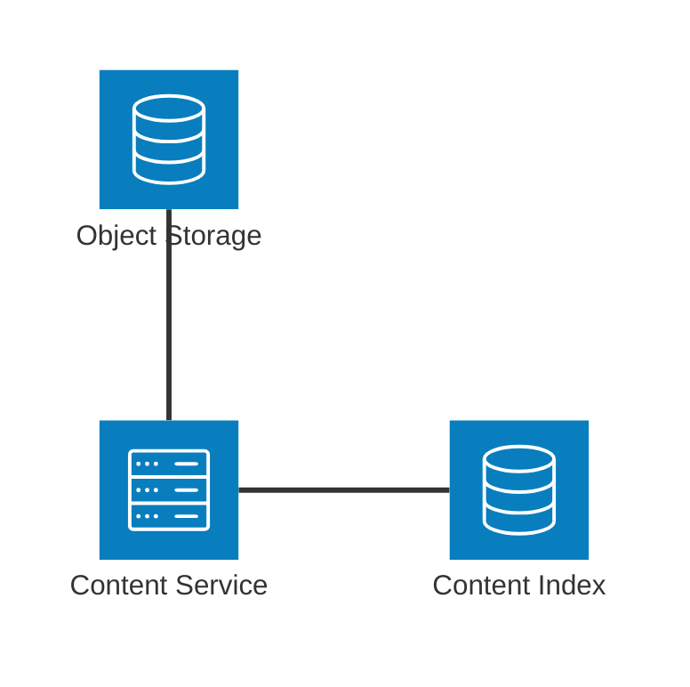

The Content Service is the heart and center of griot. It is responsible for ingesting, storing,
and indexing content from users.

## Architecture Diagram

```mermaid
architecture-beta
    service content(server)[Content Service]
    service index(database)[Content Index]
    service objects(database)[Object Storage]

    content:R -- L:index
    content:T -- B:objects
```