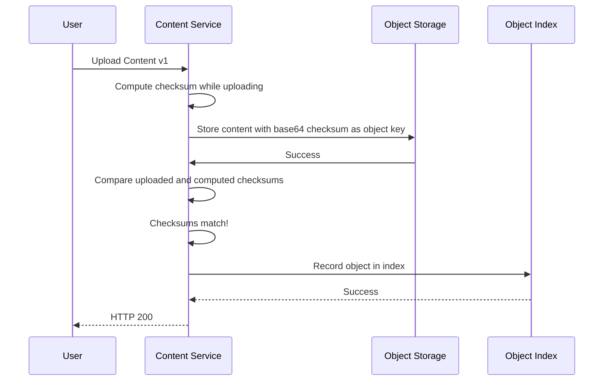

## Context Diagrams

### Happy Path

## API Description

| Descriptor | Value |
|------------|-------|
| API Type | RESTful |
| HTTP Method | POST |
| Path | /v1/content |

## Request Headers

| Name | Type | Constraint |
|------|------|------------|
| Content-Type | string | must be multipart/form-data |

## Request Body

### Form Field: metadata

| Content-Type |
|--------------|
| application/x-protobuf |

For proto message type which will be returned, please see: [Metadata](https://github.com/z5labs/griot/blob/main/services/content/contentpb/metadata.proto)

### Form Field: content

| Content-Type |
|--------------|
| Any valid [Media Type](https://en.wikipedia.org/wiki/Media_type)

## Response Headers

| Name | Value |
|------|-------|
| Content-Type | application/x-protobuf |

## Response Body

### HTTP 200

For proto message type which will be returned, please see: [UploadContentV1Response](https://github.com/z5labs/griot/blob/main/services/content/contentpb/upload_content_v1_response.proto)

### HTTP 400

For proto message type which will be returned, please see: [Status](https://github.com/z5labs/humus/blob/main/humus.proto#L14)

### HTTP 500

For proto message type which will be returned, please see: [Status](https://github.com/z5labs/humus/blob/main/humus.proto#L14)